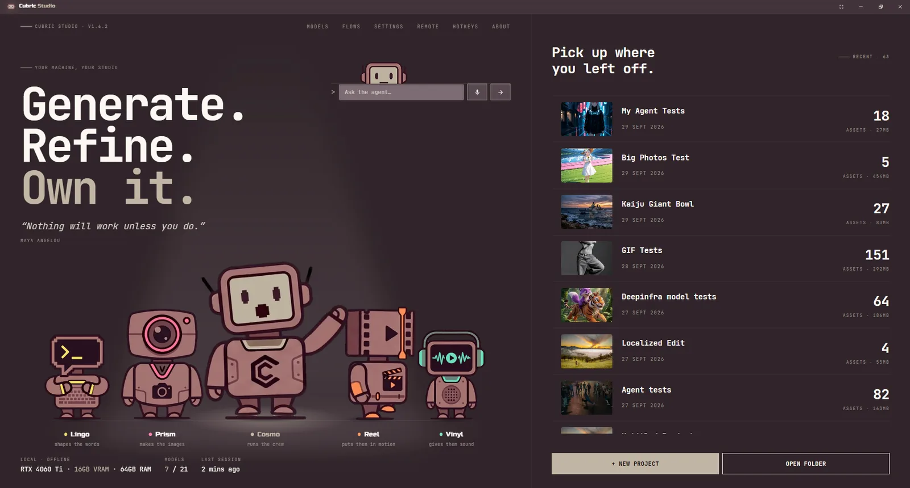
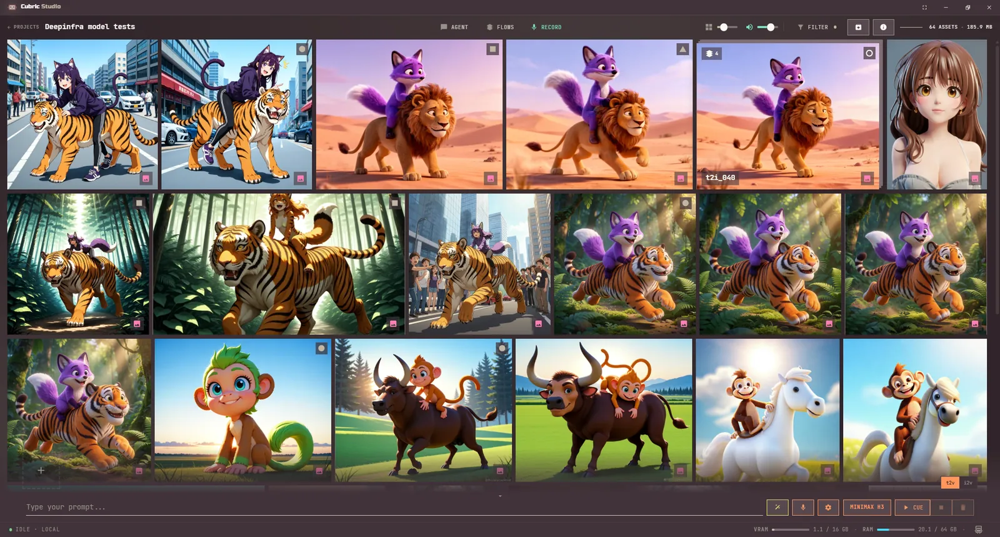
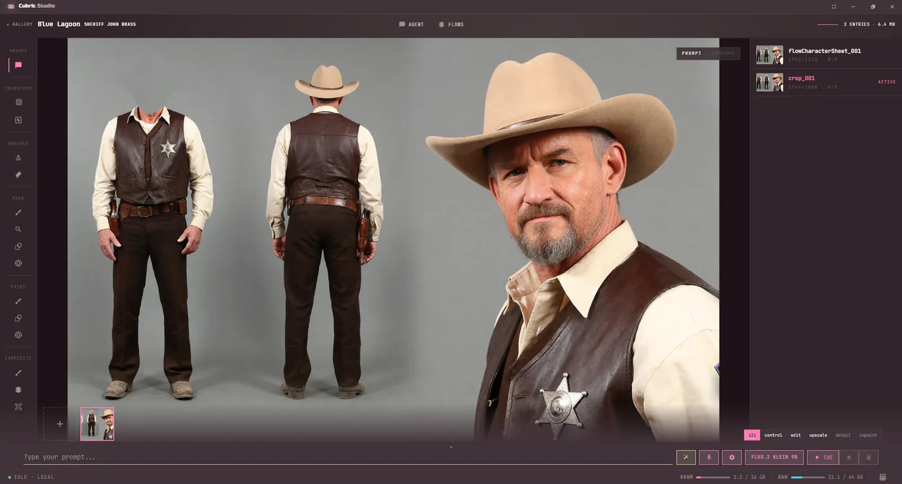
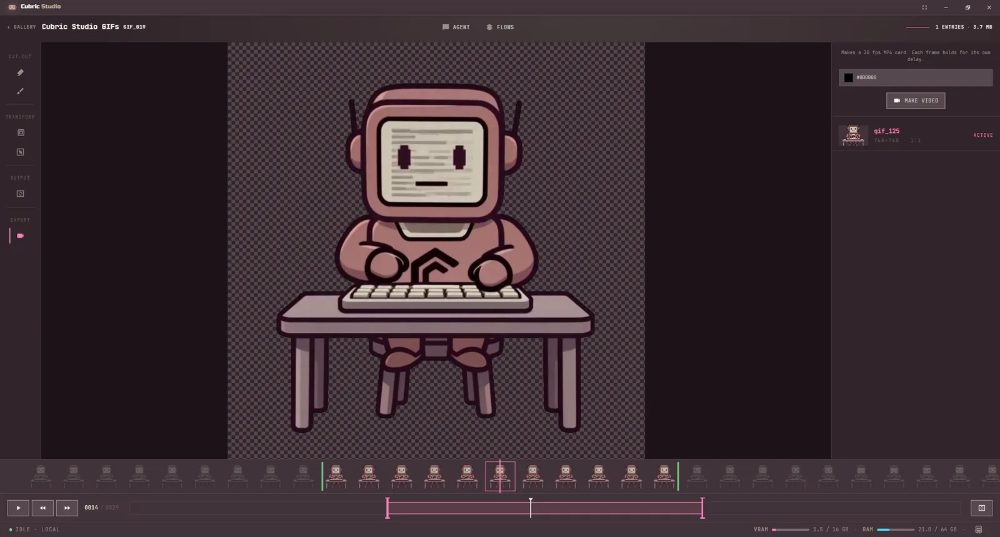
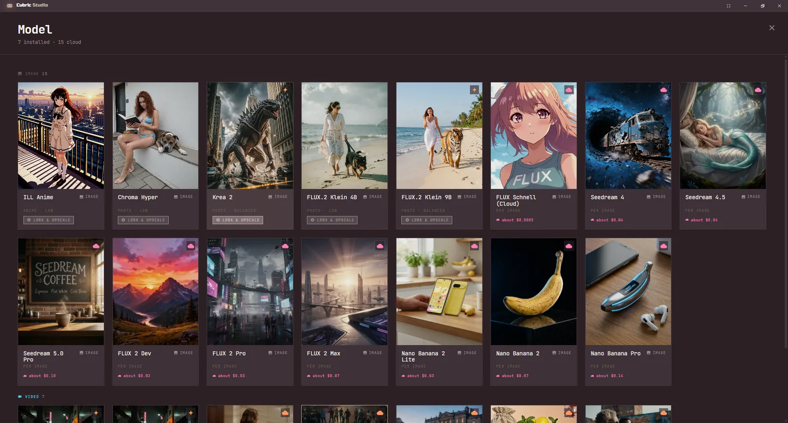
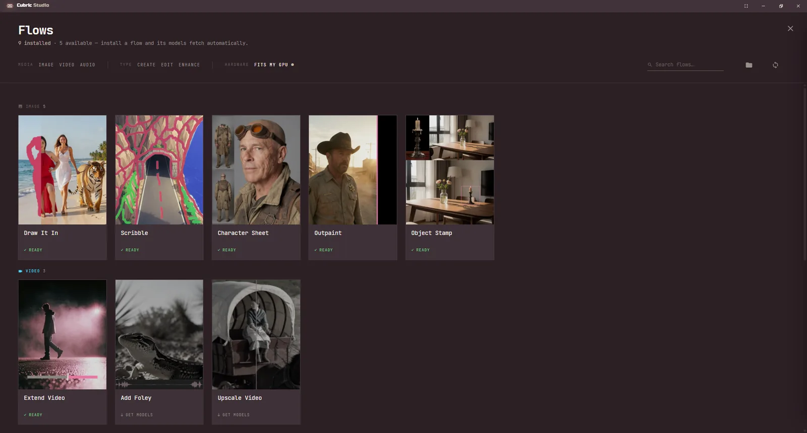
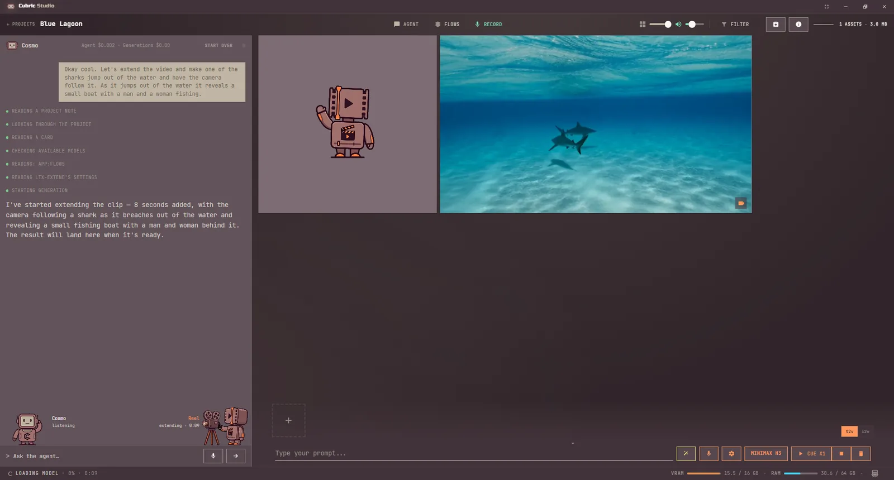

> [!NOTE]
> This repository was formerly **Cubric-Vision** (`MadPonyInteractive/Cubric-Vision`). Cubric Vision
> became Cubric Studio at version 2.0. Old links, clones and in-app update checks redirect here
> automatically.

<div align="center">

# Cubric Studio

**ComfyUI's engine without the engine room. AI images, video and sound, made easy, free and open source.**

[](https://github.com/MadPonyInteractive/Cubric-Studio/releases/latest)
[](LICENSE)
[](https://github.com/MadPonyInteractive/Cubric-Studio/releases/latest)
[](https://discord.gg/WX7tDFSVmY)
[](https://trello.com/b/wg1r5aYz/cubric-vision)
[](https://www.patreon.com/madponyinteractive)
[](https://mad-pony-interactive.gumroad.com/l/vfdxe)

[Website](https://cubric.studio) · [Documentation](https://docs.cubric.studio) · [Download](https://github.com/MadPonyInteractive/Cubric-Studio/releases/latest) · [Discord](https://discord.gg/WX7tDFSVmY) · [Roadmap](https://trello.com/b/wg1r5aYz/cubric-vision) · [Patreon](https://www.patreon.com/madponyinteractive) · [Gumroad](https://mad-pony-interactive.gumroad.com/l/vfdxe)

</div>

---

Cubric Studio is a desktop workspace for making images, video and sound on your
own machine. It runs ComfyUI as its engine, with curated models and tuned
workflows, so there are no node graphs to wire up. Type a prompt, pick a model
and press **Cue**, or ask the built-in agent in plain words. Then refine the
result with masking, editing, upscaling, video and GIF tools. Your prompts,
pictures, videos and project files stay on your disk.

Free, open source, and made by [Mad Pony Interactive](https://madponyinteractive.com).
No account and no subscription. Local generation costs nothing; cloud models and
rented GPUs are optional and billed to your own account.



## What it does

- **Image generation**: a curated lineup of the best open-source image models,
  from fast photographic generators to instruction editors that change only what
  you ask. Each ships with a tuned workflow, so you get strong results without
  parameter fiddling. Every release adds the latest models.
- **Video generation**: text-to-video, image-to-video and reference-to-video in
  stages. Preview first, then take the shot further only when it's worth the
  render time. The lineup includes models that generate with sound.
- **Sound and speech**: sound effects, instruments and instrumental music at the
  length you ask for, and text read aloud in a voice you record or pick, in 23
  languages. Dictate a prompt with the mic instead of typing.
- **Flows**: a whole job in one place, from drawing into a photo to extending a
  video or splitting a song into stems. [More below](#flows).
- **An agent inside the app**: ask for what you want in plain words and it
  picks the models, runs the generations and looks at the results.
  [More below](#the-agent).
- **Cloud models on your own key**: Seedream, FLUX.2, Nano Banana, Seedance, Wan
  and Veo through your own DeepInfra key. No download and no GPU, and the prompt
  box shows what a run costs before you press Cue.
- **Remote GPU (optional)**: can't run the heaviest models on your own machine?
  Rent a RunPod GPU on demand and generate on it instead, billed to your own
  account. Everything stays local until you connect.
- **Masking and editing**: brush masks, point masks or auto-detect, inpaint any
  region, place one picture inside another, remove backgrounds and refine
  details. Big photos (up to 16K) import and edit, and SVGs import too.
- **Upscaling**: model-based generative upscalers for images and video, plus
  your own upscaler models.
- **Video tools**: interpolate, resize, crop, upscale (sound and all), trim on
  the clip's waveform, combine and export without leaving the app.
- **GIFs**: make a GIF from selected cards or from a clip, then retime, trim and
  crop it, or cut the subject out of every frame.
- **Projects, gallery and history**: every generation lands in a project with
  full history. Compare results side by side, branch from any earlier version,
  stack and mark cards, and filter the gallery to find anything again.
- **LoRAs and custom models**: point the app at your own LoRA and upscaler
  folders alongside the curated lineup.
- **One-click setup**: the app installs its own ComfyUI engine and downloads
  models for you. After install, no internet needed for local generation.

<table>
  <tr>
    <td></td>
    <td></td>
  </tr>
  <tr>
    <td></td>
    <td></td>
  </tr>
</table>

## Flows

A Flow is a whole job in one place: it asks for what it needs a step at a time,
installs its own models and hands you a finished result. Open the Flow Library
with the **Flows** button or TAB. Eleven come with the app: Draw It In,
Scribble, Object Stamp, Character Sheet, Outpaint, Extend Video, Add Foley,
Upscale Video, Voice Changer, Song and Stems. Head Swap and DramaBox are sold
separately as Flow packages; drop a package on the library to install it.



## The agent

Press **Agent** (or A) and ask Cosmo in plain words. It picks and installs
models, runs generations and Flows, and looks at what it made. It asks before
anything costs money. Ask it to save a chain of steps as a routine ("square it,
upscale it, white background") and run that routine on any cards later. The
agent runs on your own DeepInfra, OpenRouter or OpenAI key, or free on Ollama.



### Use it from your AI agent

Claude, Codex and Antigravity can drive Cubric Studio for you: ask for "an image of a red
bicycle in a new project" and it lands in your gallery as a real card, with its prompt and
settings saved. Open **Settings > Connect an agent** and press **Connect** next to your agent.
The connection stays on your computer (`http://127.0.0.1:3000/mcp`), and the app must be open.
Needs Cubric Studio 2.0 or newer.
Manual install steps and what an agent can do:
[cubric-studio-agents](https://github.com/MadPonyInteractive/cubric-studio-agents).

## Video generation

Text-to-video and image-to-video from the latest open-source video models, run
locally, with staged previews so you spend compute only on shots worth
finishing. Some models generate with sound and support first- and last-frame
guidance.


https://github.com/user-attachments/assets/dd4c46e8-6941-49a2-b279-949fa1815aae


## Download and install

Grab the portable build for your platform from
[**GitHub Releases**](https://github.com/MadPonyInteractive/Cubric-Studio/releases/latest).
There is no installer: extract and launch. On first run the app sets up its
ComfyUI engine and asks where to store models.

**Windows:** extract the zip and run **`CubricStudio.exe`**. Windows will show
*"Windows protected your PC"*: click **More info**, then **Run anyway**. The
builds are not code-signed, so this warning is expected. If double-clicking
does nothing at all, with no message, Windows' Smart App Control may have
blocked it. It cannot make an exception for one app; code signing is the fix,
and it is not in place yet.

**macOS:** downloaded builds are quarantined. Clear it, then launch:

```bash
xattr -dr com.apple.quarantine "<extracted folder>"
```

Then double-click **`start.command`**. Setting up the local engine needs
Apple's Command Line Tools: if setup asks for them, run `xcode-select --install`
in Terminal, let the download finish, then press **Retry**.

**Linux:** extract the tarball and run **`./start.sh`**. Engine setup needs
`git`; the installer will offer to install it if it's missing.

Step-by-step instructions are in the
[installation guide](https://docs.cubric.studio/installation/).

Every build is free and public on GitHub Releases. If Cubric Studio is useful to
you, you can fund its development on
[Patreon](https://www.patreon.com/madponyinteractive) (recurring) or
[Gumroad](https://mad-pony-interactive.gumroad.com/l/vfdxe) (one-off). That is
support, not a paywall.

### What you'll need

**Windows 10/11**, **Linux**, or **macOS 14 (Sonoma) or later on Apple Silicon**. Every
Mac with an M-series chip can run macOS 14 or newer.

| Workflow | GPU VRAM | System RAM |
| --- | --- | --- |
| Images | 8 GB+ | 16–32 GB |
| Video and the heaviest image models | 12–16 GB+ | 32–64 GB |

Each model shows its own memory needs in the app, and lighter tiers are
available for smaller machines. If a model is too heavy for your GPU, run it on
a rented remote GPU instead. No suitable GPU at all? Choose **Remote only** at
first launch: the app skips the local engine and generates with cloud models.

## Documentation

The full user guide lives at [docs.cubric.studio](https://docs.cubric.studio):
[getting started](https://docs.cubric.studio/getting-started/),
[projects](https://docs.cubric.studio/projects/),
[prompt box](https://docs.cubric.studio/prompt-box/),
[gallery](https://docs.cubric.studio/gallery/),
[history](https://docs.cubric.studio/history/),
[image tools](https://docs.cubric.studio/image-tools/),
[video tools](https://docs.cubric.studio/video-tools/),
[GIFs](https://docs.cubric.studio/gifs/),
[audio](https://docs.cubric.studio/audio/),
[Flows](https://docs.cubric.studio/flows/),
[the agent](https://docs.cubric.studio/agent/),
[models](https://docs.cubric.studio/models/),
[cloud models](https://docs.cubric.studio/cloud-models/),
[remote GPU](https://docs.cubric.studio/remote/), and
[hotkeys](https://docs.cubric.studio/hotkeys/).

## Community and support

- [**Discord**](https://discord.gg/WX7tDFSVmY): questions, feedback and build
  announcements.
- [**GitHub Issues**](https://github.com/MadPonyInteractive/Cubric-Studio/issues):
  bug reports.
- [**GitHub Discussions**](https://github.com/MadPonyInteractive/Cubric-Studio/discussions):
  feature requests.
- [**Patreon**](https://www.patreon.com/madponyinteractive): a recurring
  three-tier subscription with tutorial project files and a direct line to the
  developer. Funds ongoing development.
- [**Gumroad**](https://mad-pony-interactive.gumroad.com/l/vfdxe): a one-off
  donation if you'd rather support the build without a subscription.

This app started as the first of several planned Cubric apps. They've since
folded into one, which now carries the [Cubric Studio](https://cubric.studio)
name: all local, all open source.

## For developers

Want to run from source or contribute? Start with
[docs/DEVELOPMENT.md](docs/DEVELOPMENT.md), then read
[CONTRIBUTING.md](CONTRIBUTING.md) before opening a PR. For
security-sensitive reports, see [SECURITY.md](SECURITY.md).

## License

Cubric Studio is licensed under [AGPL-3.0-only](LICENSE). Portable builds ship
with readable app source: open source isn't a marketing line here, it's how
the app is distributed.
